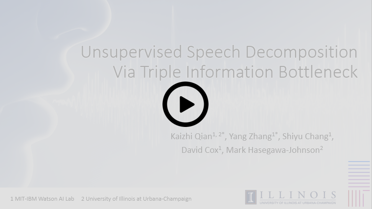

# Unsupervised Speech Decomposition Via Triple Information Bottleneck

This repository provides a PyTorch implementation of [SpeechSplit](https://arxiv.org/abs/2004.11284), which enables more detailed speaking style conversion by disentangling speech into content, timbre, rhythm and pitch.

This is a short video that explains the main concepts of our work. If you find this work useful and use it in your research, please consider citing our paper.

[](https://youtu.be/sIlQ3GcslD8)

```
@article{qian2020unsupervised,
  title={Unsupervised speech decomposition via triple information bottleneck},
  author={Qian, Kaizhi and Zhang, Yang and Chang, Shiyu and Cox, David and Hasegawa-Johnson, Mark},
  journal={arXiv preprint arXiv:2004.11284},
  year={2020}
}
```


## Audio Demo

The audio demo for SpeechSplit can be found [here](https://auspicious3000.github.io/SpeechSplit-Demo/)

## Dependencies
- Python 3.6
- Numpy
- Scipy
- PyTorch >= v1.2.0
- librosa
- pysptk
- soundfile
- matplotlib
- wavenet_vocoder ```pip install wavenet_vocoder==0.1.1```
  for more information, please refer to https://github.com/r9y9/wavenet_vocoder


## To Run Demo

Download [pre-trained models](https://drive.google.com/file/d/1JF1WNS57wWcbmn1EztJxh09xU739j4_g/view?usp=sharing) to ```assets```

Download the same WaveNet vocoder model as in [AutoVC](https://github.com/auspicious3000/autovc) to ```assets```

Run ```demo.ipynb``` 

Demo runs pretrained model using only two speakers

outputs ```spect_vc```: [(name, target utterance)]


## To Train

Download [training data](https://drive.google.com/file/d/1r1WK8c2QpjYaxKGGCap8Rm7uopBGJGNy/view?usp=sharing) to ```assets```.
The provided training data is very small for code verification purpose only.
Please use the scripts to prepare your own data for training.

1. Extract spectrogram and f0: ```python make_spect_f0.py```
  - Loads wavs from ```assets/wavs/```, separated by speakers.
  - Creates .npy files for f0 and mels, at ```raptf0```, and ```spmel``` respectively

2. Generate training metadata: ```python make_metadata.py ```
  - reads mels from ```assets/spmel```
  - creates one-hot vector of speaker embedding
  - hard codes index 1 for p226, and index 7 for p231
  - outputs: train.pkl = [[speaker, one-hot embedding, name],...] to ```spmel```

3. Run the training scripts: ```python main.py```
  - loads 'root' mels and 'feat' f0s, and ```train.pkl```
  - splices in mels and f0s to train.pkl rows to make train set - [pID, [speaker embed], [mel, f0, len, uid]]
  - samples rows for training data
  - saves a checkpoint every 1000 steps, logs every 10, validation(samples) every 1000
Please refer to Appendix B.4 for training guidance.


## Final Words

This project is part of an ongoing research. We hope this repo is useful for your research. If you need any help or have any suggestions on improving the framework, please raise an issue and we will do our best to get back to you as soon as possible.


